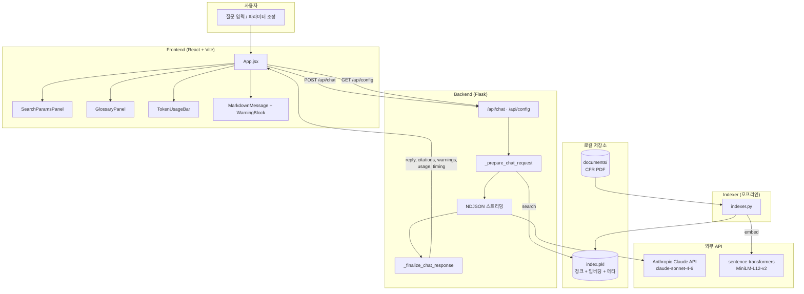

# 시스템 전체 구조 / System Overview

Frontend, Backend, Indexer, 저장소, 외부 API 간의 관계입니다.

```mermaid
flowchart TB
    subgraph User["사용자"]
        U[질문 입력 / 파라미터 조정]
    end

    subgraph Frontend["Frontend (React + Vite)"]
        App[App.jsx]
        Params[SearchParamsPanel]
        Glossary[GlossaryPanel]
        TokenBar[TokenUsageBar]
        MD[MarkdownMessage + WarningBlock]
    end

    subgraph Backend["Backend (Flask)"]
        API["/api/chat · /api/config"]
        Prep["_prepare_chat_request"]
        Final["_finalize_chat_response"]
        Stream["NDJSON 스트리밍"]
    end

    subgraph Indexer["Indexer (오프라인)"]
        IDX[indexer.py]
    end

    subgraph Storage["로컬 저장소"]
        Docs[(documents/\nCFR PDF)]
        Index[(index.pkl\n청크 + 임베딩 + 메타)]
    end

    subgraph External["외부 API"]
        Claude[Anthropic Claude API\nclaude-sonnet-4-6]
        ST[sentence-transformers\nMiniLM-L12-v2]
    end

    U --> App
    App --> Params & Glossary & TokenBar
    App -->|POST /api/chat| API
    App -->|GET /api/config| API

    API --> Prep
    Prep -->|search| Index
    Prep --> Stream
    Stream --> Claude
    Stream --> Final
    Final -->|reply, citations, warnings,\nusage, timing| App
    App --> MD

    Docs --> IDX
    IDX -->|embed| ST
    IDX --> Index
```

[← 목록으로](./README.md)
