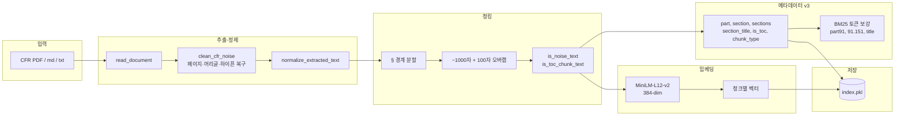

# 인덱싱 파이프라인 / Indexing Pipeline

`python indexer.py` 실행 시 CFR 문서가 `index.pkl`로 변환되는 오프라인 흐름입니다.

## 관련 함수 (`indexer.py`)

| 단계 | 함수 |
|------|------|
| 문서 읽기 | `read_document`, `read_pdf` |
| 노이즈 정제 | `clean_cfr_noise`, `normalize_extracted_text` |
| 청킹 | `chunk_text`, `_split_into_sections` |
| 메타데이터 | `extract_chunk_metadata`, `build_record_tokens` |
| 임베딩 | `embed`, `get_model` |
| 저장 | `build_index`, `save_index` |

[← 목록으로](./README.md)
