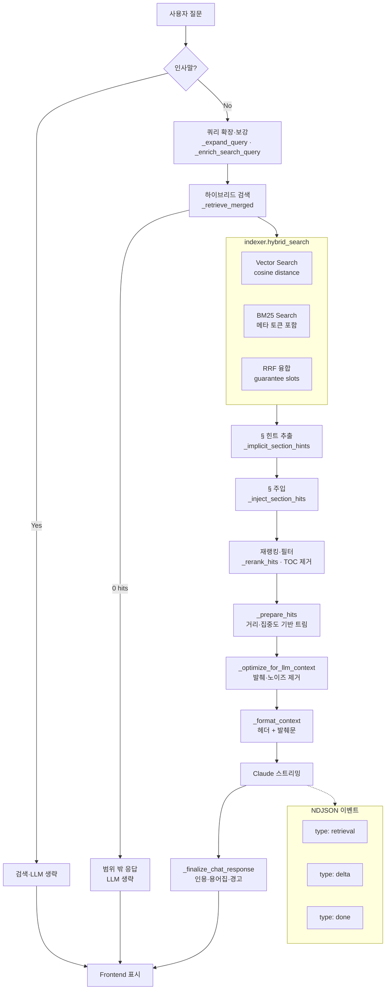

# 질의·응답 파이프라인 / Query-Response Pipeline

`POST /api/chat` 요청이 검색·생성·응답까지 처리되는 온라인 흐름입니다.

## 스트리밍 이벤트 순서

1. `retrieval` — 검색 쿼리, 히트 수, retrieval 요약
2. `delta` — LLM 토큰 스트리밍 (반복)
3. `done` — 최종 reply, citations, warnings, usage, timing

## 토큰 절약 분기

| 조건 | 동작 |
|------|------|
| 인사말 | 검색·LLM 모두 생략 |
| 검색 0건 | LLM 생략, 범위 밖 응답 |
| 강한 매칭 | 청크 수·컨텍스트 축소 |
| 짧은 질문 | `max_tokens` 512로 축소 |

[← 목록으로](./README.md)
