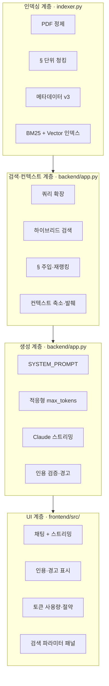

# 레이어별 책임 / Layer Responsibilities

4개 계층(인덱싱 → 검색·컨텍스트 → 생성 → UI)의 역할 분리입니다.

## 계층별 주요 파일

| 계층 | 경로 | 핵심 컴포넌트 |
|------|------|---------------|
| 인덱싱 | `indexer.py` | `build_index`, `hybrid_search` |
| 검색·컨텍스트 | `backend/app.py` | `_retrieve_merged`, `_optimize_for_llm_context` |
| 생성 | `backend/app.py` | `_chat_stream`, `_finalize_chat_response` |
| UI | `frontend/src/` | `App.jsx`, `TokenUsageBar`, `GlossaryPanel` |

[← 목록으로](./README.md)
