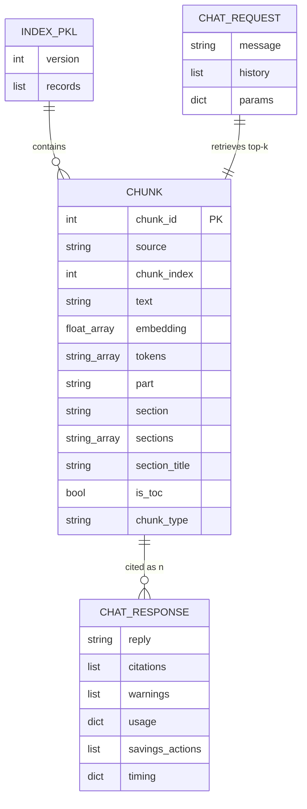

# 데이터 모델 / Data Model

인덱스 청크 레코드와 채팅 요청·응답 간의 관계입니다.



## 청크 레코드 예시

```json
{
  "chunk_id": 42,
  "source": "CFR-2025-title14-vol2-part91.pdf",
  "chunk_index": 3,
  "text": "§ 91.151 Fuel requirements for flight in VFR conditions...",
  "embedding": [0.12, -0.04, "..."],
  "tokens": ["fuel", "requirements", "part91", "91.151", "..."],
  "part": "91",
  "section": "91.151",
  "sections": ["91.151"],
  "section_title": "Fuel requirements for flight in VFR conditions",
  "is_toc": false,
  "chunk_type": "section"
}
```

## API 응답 주요 필드

| 필드 | 설명 |
|------|------|
| `reply` | LLM 생성 답변 (Markdown) |
| `citations` | `[n]` 인용과 청크 발췌문 매핑 |
| `warnings` | 외부 참조·근거 부족 등 경고 |
| `usage` | input/output/total 토큰 수 |
| `savings_actions` | 토큰 절약 조치 목록 |
| `timing` | retrieval_ms, llm_ms, total_ms |

[← 목록으로](./README.md)
